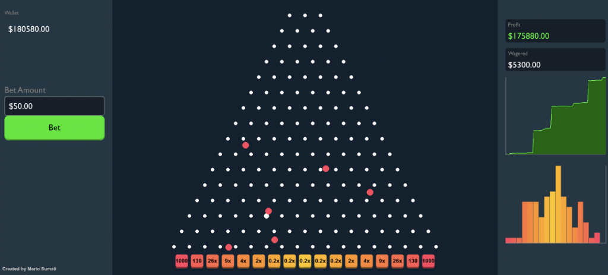

# Plinko



Based on Stake Plinko.

## Created by Mario Sumali

## Installation

1. Ensure you have Python installed.
2. Install the required dependencies:

```bash
pip install pygame numpy
```

## How to Run

```bash
python plinko.py
```

## Controls

- Spacebar: Drop a ball (Hold to spam)
- Mouse: Click stuff
- R: Reset
